## MVP Demo

### System Diagram Overview

The team's system design consists of two main components: a smart furniture module powered by an ATmega328PB microcontroller and a wand controller centered around the Nano 33 microcontroller, equipped with Wi-Fi signal transmission capabilities. The wand integrates a power supply system using three AA batteries to ensure stable power delivery to the Nano 33 and the WS2812b light strip. The Nano 33 leverages its onboard gyroscope and Inertial Measurement Unit (IMU) to capture real-time angular velocity and motion data, which form the basis for gesture recognition.

<p align="center">
    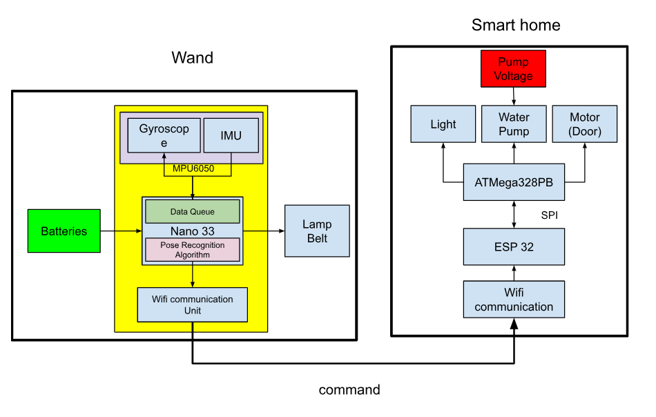
</p>
<p align="center"><strong>Figure 1: </strong> The Overview of Design Schematic</p>

The motion data collected by the Nano 33 is aggregated and processed to train machine learning models aimed at accurately classifying three distinct wand gestures: circular, triangular, and linear motions. The resulting trained parameter matrix is then deployed directly onto the Nano 33, enabling on-device gesture recognition. When the user performs a gesture, the wand processes the motion data and encodes the recognized gesture into an 8-bit binary signal (e.g., 1 for a circle, 2 for a triangle, and 3 for a line). This signal is transmitted wirelessly via the Nano 33's Wi-Fi module to an ESP32 device connected to the same local network.

<p align="center">
    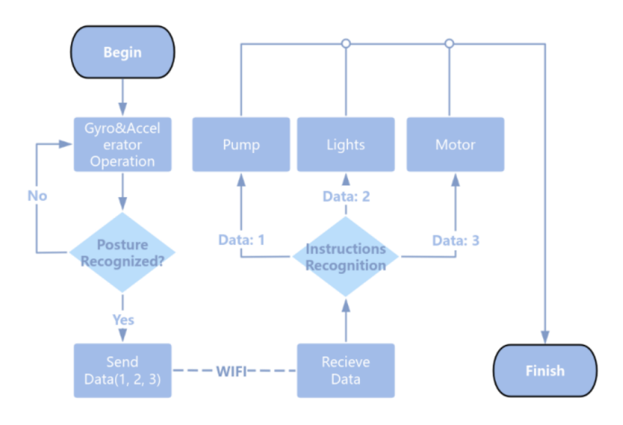
</p>
<p align="center"><strong>Figure 2: </strong> The Flow Diagram Of the Adapted Program Design</p>

The ESP32 is configured with a static IP address defined at the software level, ensuring reliable communication within the network. Upon receiving the gesture signal, the ESP32 forward it to the ATmega328PB microcontroller using the SPI communication protocol. The ATmega328PB then decodes the signal and executes the corresponding predefined actions, such as controlling lighting, activating a water pump, or driving a motor.
This integrated system demonstrates a seamless interaction between the wand and the smart furniture, achieving the team's vision of a gesture-based controller for smart home automation. Each subsystem is designed with modularity and scalability in mind, ensuring a robust and efficient implementation of the team's concept.

### Home Model (ATmega328PB+ESP32)

The configuration of ATmega328PB is shown below:

<p align="center">
    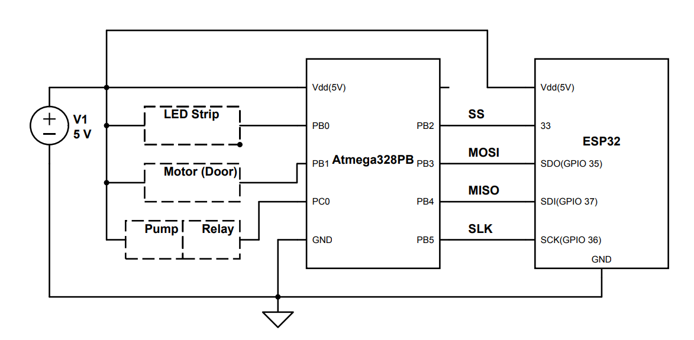
</p>
<p align="center"><strong>Figure 3: </strong> The Wire Configuration of ATmega328PB</p>

This block diagram illustrates the connection between the ATmega328PB microcontroller, the ESP32 module, and peripheral components. The ATmega328PB connects to peripherals as follows: PB0 handles LED, PB1 controls the motor (door), and PC0 interfaces with the pump, with Vdd providing 5v and GND providing the ground connection. The ATmega328PB communicates with the ESP32 using the SPI protocol, where PB2 connects to SS, PB3 to MOSI, PB4 to MISO and PB5 to SCK. The ESP32's SPI pins are connected to SDI (GPIO 37), SDO (GPIO 35), SS (GPIO 33) and SCK (GPIO 36). Both the ATmega328PB and ESP32 share a common 5V power supply via Vdd and are grounded to the same GND pin. This configuration enables the ATmega328PB to control peripherals while communicating with the ESP32 for advanced processing or wireless functionality.

#### 1. Home Model 3D Printing

The walls of our smart furniture model are created using laser cutting. The core part is designed to accommodate a servo motor, which controls the door's opening and closing. We modeled it to ensure the servo motor can be properly installed.

<p align="center">
    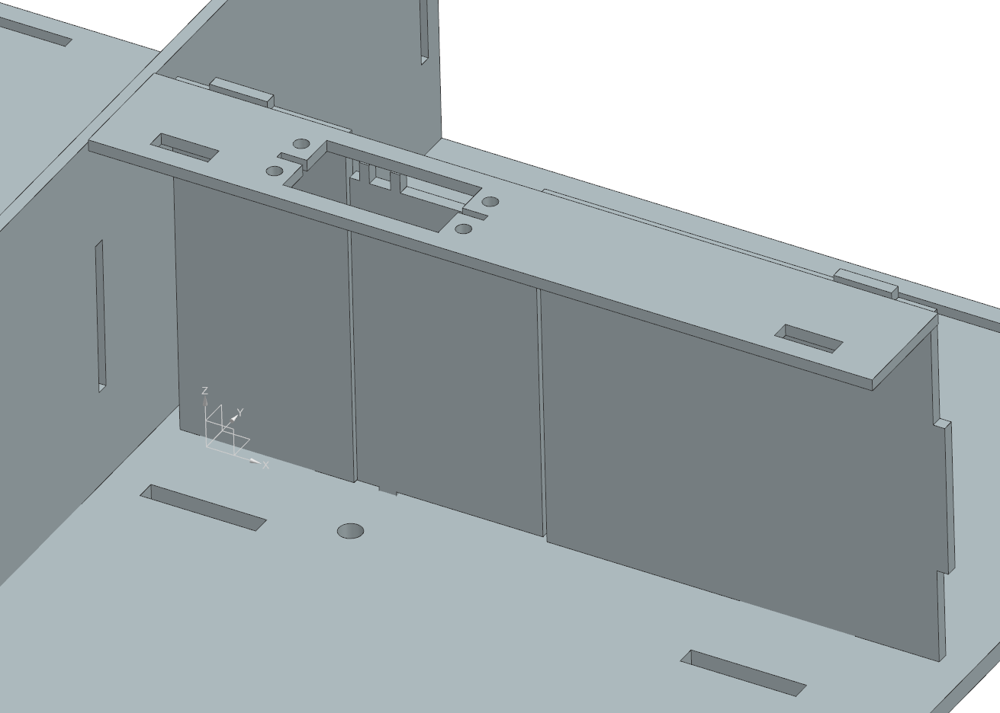
</p>

<p align="center">
    <strong>Figure 4:</strong> The 3D Module of The Gate
</p>


#### 2. Main Control

In Atmega328Pb, we should continuously check whether data sent from the ESP32 has been received. Upon reception, we use an if statement to evaluate its value and execute different operations accordingly. The core bare metal C are shown below:

```c
while (1) {
    if (data_received) {
        if (data == 1) door_status ^= 1, motor_angle(door_status ? 90 : 0);
        else if (data == 2) light_status ^= 1, ws2812b_send(light_status ? 255 : 0, 255, 255);
        else if (data == 3) pump_status ^= 1, PUMP_PORT ^= (1 << PUMP_PIN); }}

```
We will excute different command based on the data transferred. 

#### 3. SPI

SPI (Serial Peripheral Interface) is a high-speed, full-duplex communication protocol commonly used for short-distance communication between microcontrollers and peripheral devices. It operates with a master-slave architecture, where the master device controls the clock signal (SCK), enabling synchronized data exchange. SPI uses four main lines: MOSI (Master Out Slave In), MISO (Master In Slave Out), SCK (Serial Clock), and SS (Slave Select). It is known for its simplicity, high data transfer rate, and flexibility, making it ideal for applications like sensor data acquisition, memory interfacing, and communication between processors.

In our project, it is used to transfer data from ESP32 to Atmega328PB to send instructions. To implement this communication protocol, we need to code Slave Mode in Atmega328pb and Master Mode in ESP32.

#### 3.1 Slave (ATmega328PB)

The core codes are shown below to initialize Slave Mode:

```c
#include <stdlib.h>
#include <avr/interrupt.h>
#include <stdio.h>
#include <avr/io.h>
uint8_t SPI_SlaveReceive();
void SPI_Slave_initialize()
{
    SPI_DDR |= (1 << SPI_MISO);
    SPCR0 |= (1 << SPE);
}
uint8_t SPI_SlaveReceive()
{
    while(!(SPSR0 & (1<<SPIF)));
    return SPDR0;
}
```
- SPI_DDR:
Refers to the Data Direction Register for the SPI port, where individual bits control whether a pin is an input or output. By setting SPI_MISO as output, the slave can send data back to the master.
- SPCR0 (SPI Control Register):
Contains control bits for SPI configuration. The SPE bit enables the SPI module.
- SPSR0 (SPI Status Register):
The SPIF (SPI Interrupt Flag) bit in this register is set when a data transfer is complete. The function polls this bit to ensure data is ready to be read.
- SPDR0 (SPI Data Register):
This register holds the data received from the SPI master. Reading from it retrieves the received byte.

Overall, we enabled SPI, configured it in Slave mode, and set the data transfer mode to the default Mode 0, which must match the configuration in the ESP.

#### 3.2 Master (ESP32)

The SPI configuration process on the ESP32 is straightforward and similar to previous setups. It involves accessing the relevant registers, enabling SPI, setting it to Master mode, and using Mode 0 for the transfer mode to ensure proper communication. By default, the ESP32 supports four SPI buses, but currently, only HSPI and VSPI are available for use. However, due to the unique GPIO mapping of the ESP32 Feather S2, the pin assignments differ, as shown in the diagram below：

<p align="center">
    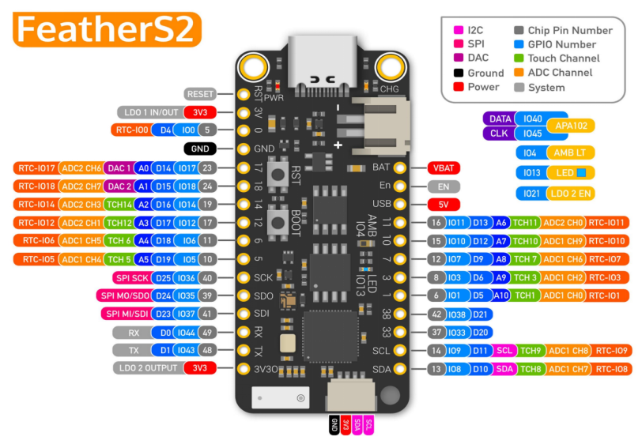
</p>
<p align="center"><strong>Figure 6: </strong> The Pin Layout Of ESP32 Feather S2</p>

The core codes to implement are shown:

- Header Files and Macro Definition

```c
#include "esp32/rom/gpio.h"
#include "soc/spi_struct.h"
#include "soc/gpio_sig_map.h"
#include "soc/io_mux_reg.h"
#include "driver/gpio.h"
```
These headers provide access to the ESP32's hardware abstraction layer (HAL) and GPIO control, enabling direct manipulation of hardware registers.

-SPI Master Initialization Function

```c
void spi_master_init() {
    gpio_set_direction(VSPI_SCK, GPIO_MODE_OUTPUT); // Set SCK as output
    gpio_set_direction(VSPI_MOSI, GPIO_MODE_OUTPUT); // Set MOSI as output
    gpio_set_direction(VSPI_MISO, GPIO_MODE_INPUT); // Set MISO as input
    gpio_set_direction(VSPI_CS, GPIO_MODE_OUTPUT); // Set CS as output
```
Configures the GPIO pins for SPI functionality. SCK, MOSI, and CS are outputs; MISO is input.
```c
SPI3.user.val = 0;
    SPI3.user.doutdin = 0;         // Data is not bidirectional
    SPI3.user.duplex = 0;          // Full duplex mode disabled
    SPI3.ctrl.val = 0;
    SPI3.ctrl.wr_bit_order = 0;    // Use MSB-first for writes
    SPI3.ctrl.rd_bit_order = 0;    // Use MSB-first for reads
```
Maps the GPIO pins to the corresponding SPI functions using the ESP32's GPIO matrix. Then we Initialize the SPI3 user and control registers. Configures bit order and sets the transfer mode.
```c
SPI3.clock.val = 0;
    SPI3.clock.clkcnt_n = 7;       // Clock divider setup
    SPI3.clock.clkcnt_h = 3;
    SPI3.clock.clkcnt_l = 7;
    SPI3.cmd.usr = 0;        // Ensure no ongoing SPI command
    }
```
Configures the SPI clock, setting the frequency divider. Then we implement SPI Master Send Function:
```c
void spi_master_send(uint8_t *data, int len) {
    for (int i = 0; i < len; i++) {
        SPI3.data_buf[i] = data[i];  // Load data into SPI buffer
    }
```
Configures the data length for transmission, starts the SPI transaction, and waits for it to complete. The CS (chip select) line is toggled to signal the start and end of the transmission. Then Load the data to be transmitted into the SPI3 buffer.
```c
  SPI3.mosi_dlen.usr_mosi_dbitlen = len * 8 - 1; // Set data length (in bits)
    gpio_set_level(VSPI_CS, 0);     // Assert CS (active low)
    SPI3.cmd.usr = 1;               // Start SPI transaction
    while (SPI3.cmd.usr);           // Wait until transmission completes
    gpio_set_level(VSPI_CS, 1);     // Deassert CS
}
```
#### 4.LED

#### 4.1 WS2812 Working Principle

The LED Strip has three ports: Vdd, GND and Signal Pin. 

Individually addressable LED strips operate using a digital data protocol. The Atmega328Pb sends a signal that represents 1s and 0s through the data pin. The LEDs interpret this signal to set their colors and brightness.

For WS2812 LEDs (Common Protocol):
The microcontroller sends data in the form of pulse-width modulation (PWM). The duration of the pulse determines whether it's a 1 or 0.

<p align="center">
    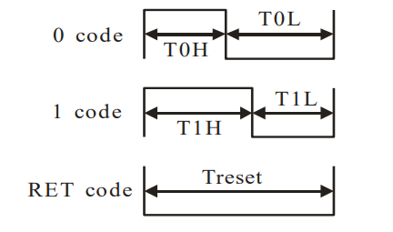
</p>
<p align="center"><strong>Figure 9: </strong> The Protocol In WS2812 LEDs</p>

- 0 Signal:
A short high pulse followed by a longer low pulse.
Example: High for 0.35 μs, then Low for 0.8 μs.
- 1 Signal:
A longer high pulse followed by a shorter low pulse.
Example: High for 0.7 μs, then Low for 0.6 μs.
The WS2812 LEDs decode these timing differences to differentiate between 0 and 1.

Protocol Timing:
The WS2812 operates at a frequency of 800 kHz.
Each LED receives a 24-bit data frame (8 bits each for Red, Green, and Blue channels).

#### 4.2 Implementation in Atmega328Pb using Bare C

In our Atmega328Pb, we write bare metal C to give signal data. The core function is 'ws2812b_send_bit', which is designed to send a single bit (0 or 1) to a WS2812B LED strip by generating a pulse-width-modulated (PWM) signal with precise timing. It uses inline assembly to directly manipulate the microcontroller's hardware registers for accurate timing control.

##### Sending a 1 Bit
```c
if (bit != 0)
{
    asm volatile (
        "sbi %[port], %[pb]     \n\t"   // Set the LED pin high
        "nop                    \n\t"   // Delay to achieve ~0.8 μs
        "nop                    \n\t"
        "nop                    \n\t"
        ...
        "cbi %[port], %[pb]     \n\t"   // Set the LED pin low
        "nop                    \n\t"   // Delay for the remaining ~0.45 μs
        "nop                    \n\t"
        ...
        ::
        [port]      "I" (_SFR_IO_ADDR(LED_PORT)),  // I/O port for LED
        [pb]        "I" (LED_PIN)                 // Pin connected to LED
    );
}
```
1. sbi (Set Bit in I/O Register):

* Sets the LED pin high (LED_PIN) on the specified port (LED_PORT).
* This starts the pulse.

2. nop (No Operation):

* Inserts a small delay. Each nop takes 1 clock cycle. 
* A sequence of nops creates a delay to ensure the high signal duration is ~0.8 μs.

3. cbi (Clear Bit in I/O Register):

* Sets the LED pin low (LED_PIN).
Ends the pulse after the high signal duration.
4. More nops:

* Adds additional delay to ensure the low signal duration is ~0.45 μs.
5. Assembly Arguments:
* [port]: The I/O address of the port controlling the LED.
* [pb]: The pin number on that port connected to the LED.
##### Sending a 0 Bit
```c
else
{
    asm volatile (
        "sbi %[port], %[pb]     \n\t"   // Set the LED pin high
        "nop                    \n\t"   // Delay to achieve ~0.4 μs
        "nop                    \n\t"
        ...
        "cbi %[port], %[pb]     \n\t"   // Set the LED pin low
        "nop                    \n\t"   // Delay for the remaining ~0.85 μs
        ...
        :: 
        [port]      "I" (_SFR_IO_ADDR(LED_PORT)),  // I/O port for LED
        [pb]        "I" (LED_PIN)                 // Pin connected to LED
    );
}
```
1. sbi:
* Sets the LED pin high, starting the pulse.
2. nops for ~0.4 μs:
* Creates a shorter high signal duration compared to a 1 bit.
3. cbi:
* Sets the LED pin low to end the high signal.
4. nops for ~0.85 μs:
* Ensures the low signal duration is longer compared to a 1 bit.

It is conntrolled by command: 2
```c
 else if (data == 2) // toggle light 
        {
            light_status ^= 1;
            if (light_status)
            {
                ws2812b_send(255, 255, 255);
                ws2812b_send(255, 255, 255);
                ws2812b_send(255, 255, 255);
            }
            else
            {
                ws2812b_send(0, 0, 0);
                ws2812b_send(0, 0, 0);
                ws2812b_send(0, 0, 0);
            }
        }
```
#### 5.Pump
The water pump is controlled by a relay, powered by a 5-24V supply. The Atmega328 microcontroller uses the PC0 pin to control the relay, which in turn switches the pump on and off. The connection diagram is shown below:

<p align="center">
    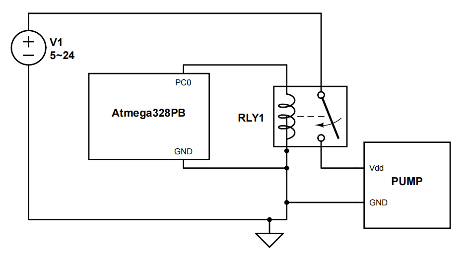
</p>
<p align="center"><strong>Figure 10: </strong> The Configuration of Pump</p>

The pump is controlled by command: 3
```c
  else if (data == 3) // toggle pump
        {
            pump_status ^= 1;
            if (pump_status)
            {
                PUMP_PORT |= (1 << PUMP_PIN);
            }
            else
            {
                PUMP_PORT &= ~(1 << PUMP_PIN);
            }
```

#### 6.Motor (Door)

Generally, we use PWM to control the motor to enable it to rotate 90 degrees. There are three ports in the motor: PWM, Vdd and GND. The motor is powered by 5V. And the PWM singnal is controlled by the ATmega328Pb through PB1, its connection configuration is shown below:

<p align="center">
    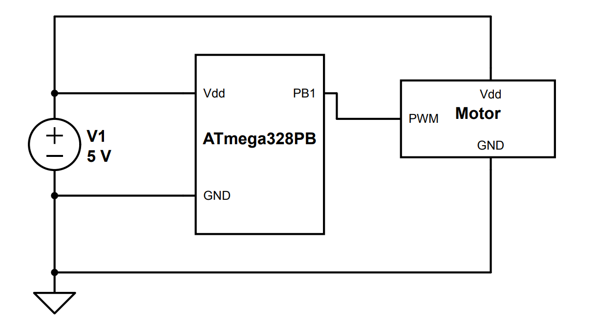
</p>
<p align="center"><strong>Figure 11: </strong> The Configuration of the Motor</p>

To controll the PWM singals, we coded the ATmega328Pb. There are two main functions:

>. motor_initialize(int angle): Sets up Timer 1 in Fast PWM mode with a frequency of 50 Hz and an initial angle for the motor.

```c
MOTOR_DDR |= (1 << MOTOR_PIN);
TCCR1A |= (1 << COM1A1) | (1 << WGM11);
TCCR1B |= (1 << WGM13) | (1 << CS11);
```
This function initializes the motor's control settings using Timer 1 in Fast PWM mode and Configures the motor control pin (MOTOR_PIN) as an output by setting the corresponding bit in the data direction register (MOTOR_DDR):

- COM1A1: Configures the timer's compare match behavior to output the PWM signal on OCR1A (non-inverting mode).
- WGM11: Part of the Waveform Generation Mode settings to enable Fast PWM mode.
- WGM13: Completes the configuration for Fast PWM mode using Timer 1.
- CS11: Sets the clock prescaler to 8, which determines the timer's counting speed.
```c
ICR1 = 20000;
```
It sets the top value for the timer counter to 20000. This defines the PWM period. Assuming an 8 MHz clock and a prescaler of 8, this corresponds to a 50 Hz PWM frequency (commonly used for servo motors).
```c
OCR1A = angle;
```
This part sets the initial duty cycle for the PWM signal on the OCR1A pin. The value corresponds to the desired initial angle of the motor.

>.motor_angle(int angle): Converts a desired angle into a PWM pulse width and updates the timer's compare register (OCR1A) to adjust the motor's position.

This function adjusts the motor's angle by setting the appropriate PWM duty cycle
```c
int output = angle / 90 * 1000 + 500;
```
- Converts the angle (in degrees) to a PWM pulse width in microseconds:

1. For 0°, the pulse width is 500 µs.
2. For 90°, the pulse width is 1500 µs.
3. For 180°, the pulse width is 2500 µs.

```c
 OCR1A = output;
```

This updates the OCR1A register to change the PWM duty cycle and adjust the motor angle accordingly.

It is controlled by command: 1
```c
 if (data == 1)  // toggle door
        {
            door_status ^= 1;
            if (door_status)
            {
                motor_angle(90);
            }
            else
            {
                motor_angle(0);
            }
        }
```

### Wand Diagram

This diagram illustrates the integration of a Nano 33 microcontroller, an LED strip, and a battery pack in the wand basic circuit. The Nano 33 is powered by a 4.5–4.8V battery pack while sharing a common ground with the entire circuit. The LED strip, also powered by the same battery pack, receives control signals from the Nano 33 via the PB6 pin, enabling dynamic operation such as color and brightness adjustments. The setup emphasizes efficient power distribution and signal synchronization, with a shared ground ensuring proper circuit functionality.
<p align="center">
    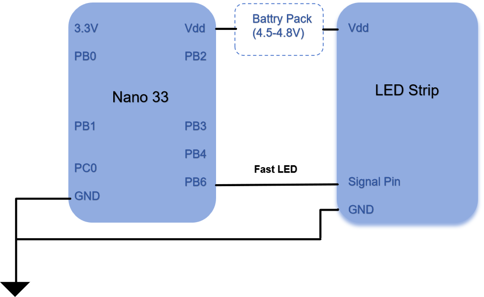
</p>
<p align="center"><strong>Figure 7: </strong> The Pin Layout Of The Wand</p>
To ensure consistent data reading from the gyro and IMU, we added interrupts to the Nano 33. This allows us to read data every 100ms, avoiding irregular and inconsistent readings caused by varying processing times of the data matrix. This improvement helps maintain the accuracy of gesture recognition and ensures the standardization of the data.


#### 1.Home Model 3D Printing

The walls of our smart furniture model are created using laser cutting. The core part is designed to accommodate a servo motor, which controls the door's opening and closing. We modeled it to ensure the servo motor can be properly installed.

<p align="center">
    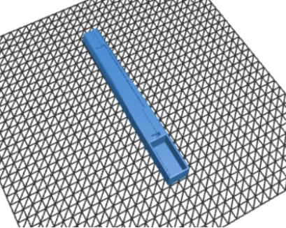
    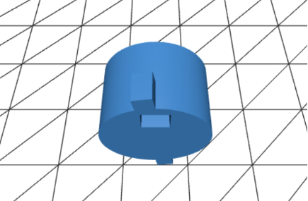
</p>

<p align="center">
    <strong>Figure 8:</strong> The 3D Module of The Wand
</p>

My wand requires a wide-voltage power supply using three batteries along with a buck converter to provide stable power for the Nano 33. The Nano 33 connects to an LED strip to provide feedback for different gestures, offering users a good interactive experience. Therefore, we designed a dedicated model for it. The model includes a centrally positioned battery compartment with a knob-style latch for easy battery installation and replacement, ensuring continuous usage. Additionally, we designed a groove for the LED strip to enhance the wand's aesthetic appeal.

#### 2.Light Strip Control In Nano33

The LED Strip has three ports: Vdd, GND and Signal Pin. The connection configuration is shown before in Fig 7.

Individually addressable LED strips operate using a digital data protocol. A microcontroller (like Nano 33) sends a signal that represents 1s and 0s through the data pin. The LEDs interpret this signal to set their colors and brightness.

* For a 1 bit: The signal stays high for approximately 0.8 μs.
Then it goes low for approximately 0.45 μs.

* For a 0 bit: The signal stays high for approximately 0.4 μs.
Then it goes low for approximately 0.85 μs.

In our design, we write a function to create a "wave-like" animation effect on an LED strip controlled by the FastLED library. It will sequentially light up LEDs in a "wave" pattern along the strip. Only one LED is actively lit at any given time, while the previously lit LED is turned off. The animation stops when it completes one full pass along the length of the strip. The core codes are shown below:

- Step 1: Check if the Wave Animation is Enabled
```c
if (!LED_flow_enable)
    return;
```
- Step 2: Check if the Animation is Complete
```c
if (LED_flow_counter >= LED_NUM)
```
1. Turn Off the Last LED:
```c
leds[LED_NUM - 1] = CRGB::Black;
The last LED in the strip is turned off by setting its color to CRGB::Black.
```
2. Update the LED Strip:
```c
FastLED.show();
The FastLED.show() function sends the updated LED data to the strip to reflect the changes.
```
3. Reset the Animation:
```c
LED_flow_enable = 0;
LED_flow_counter = 0;
```
- Step 3: Continue the Animation if Not Complete
```c
else
```
If the wave animation is not complete (LED_flow_counter < LED_NUM), the function lights up the next LED in the sequence and turns off the previous one:
1. Turn Off the Previous LED:
```c
leds[max(LED_flow_counter - 1, 0)] = CRGB::Black;
```
The LED at the position LED_flow_counter - 1 (the previous LED) is turned off.

The max() function ensures the index does not go below 0 (to avoid accessing out-of-bounds memory).

2. Light Up the Current LED:
```c
leds[LED_flow_counter] = LED_flow_color;
```
The LED at the position LED_flow_counter (the current LED) is set to the specified wave color (LED_flow_color).

3. Update the LED Strip:
```c
FastLED.show();
```

Sends the updated data to the LED strip to reflect the changes (turning off the previous LED and lighting up the current one).

4. Increment the Counter:

```c
++LED_flow_counter;
```
The counter is incremented to move to the next LED for the subsequent call of this function.

On every call to show_wave(), this function checks if the wave animation is enabled and either:
* Completes and resets the animation if the last LED has been reached.
* Lights up the current LED, turns off the previous one, and moves to the next LED if the animation is still ongoing.

#### 3.IMU & Gyroscope data reading and processing

Basically, the whole reading process is shown below:

<p align="center">
    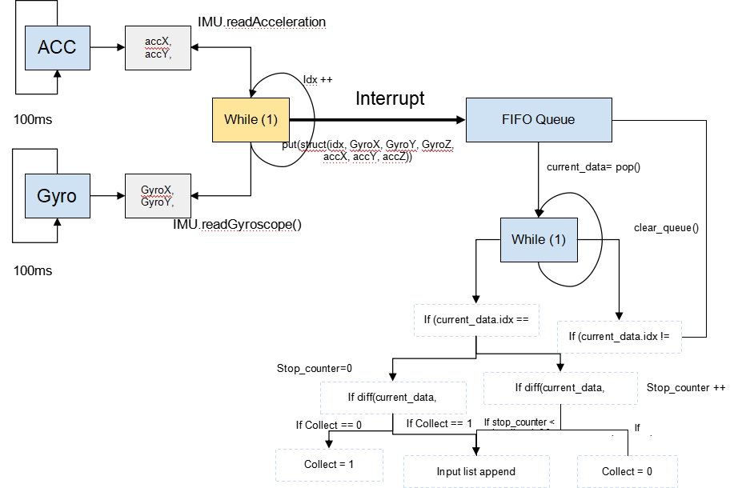
</p>
<p align="center"><strong>Figure 8: </strong> The Data Processing Flow Chart</p>

To ensure consistent data reading from the gyro and IMU, we added interrupts to the Nano 33. This allows us to read data every 100ms, avoiding irregular and inconsistent readings caused by varying processing times of the data matrix. This improvement helps maintain the accuracy of gesture recognition and ensures the standardization of the data.

The interrupt function is:
```c
extern "C" void TC3_Handler()
{
    // Check if the match interrupt flag is set
    if (TC3->COUNT16.INTFLAG.bit.MC0)
    {
        // Clear the interrupt flag
        TC3->COUNT16.INTFLAG.reg = TC_INTFLAG_MC0;
        show_wave();
    }
}
```
These codes are to implement Timer3 in the Nano33 for trigerring interupt. We aim to read data every 100ms while not stop the data processing.

```c
void configure_timer()
{
    GCLK->CLKCTRL.reg = GCLK_CLKCTRL_ID_TCC2_TC3_Val;    // select TC3 peripheral channel
    GCLK->CLKCTRL.reg |= GCLK_CLKCTRL_GEN_GCLK0;        // select source GCLK_GEN[0]
    GCLK->CLKCTRL.bit.CLKEN = 1;            // enable TC3 generic clock

    // Configure synchronous bus clock
    PM->APBCSEL.bit.APBCDIV = 0;            // no prescaler
    PM->APBCMASK.bit.TC3_ = 1;                // enable TC3 interface

    // Configure Count Mode (16-bit)
    TC3->COUNT16.CTRLA.bit.MODE = 0x0;

    // Configure Prescaler for divide by 2 (500kHz clock to COUNT)
    TC3->COUNT16.CTRLA.reg |= TC_CTRLA_PRESCALER_DIV1024;;

    // Configure TC3 Compare Mode for compare channel 0
    TC3->COUNT16.CTRLA.bit.WAVEGEN = 0x1;            // "Match Frequency" operation

    // Initialize compare value for 100mS @ 500kHz
    TC3->COUNT16.CC[0].reg = 4687;

    // Enable TC3 compare mode interrupt generation
    TC3->COUNT16.INTENSET.bit.MC0 = 0x1;    // Enable match interrupts on compare channel 0 

    NVIC_EnableIRQ(TC3_IRQn);   // Enable TC3 interrupt in the NVIC
    // Enable TC3
    TC3->COUNT16.CTRLA.bit.ENABLE = 1;

    // Wait until TC3 is enabled
    while(TC3->COUNT16.STATUS.bit.SYNCBUSY == 1);
    NVIC_SetPriority(TC3_IRQn, 3);
    NVIC_EnableIRQ(TC3_IRQn);
    __enable_irq();
}
```

After reading the data accelerometer and gyroscope, we assign an index_counter to the data starting from 0 and accumulate for each instance of data by 1 to allow the calculation process to monitor the continuity of the input data, in the form of

<p align="center">[index, gyroX, gyroY, gyroZ, accX, accY, accZ]</p>

We use ISR to push the data onto a queue to make sure the input data to form a continuous sequence of serial data list. 

Below is the ISR handler logic we use to update data on the queue. We have a semaphore to avoid race conditions for checking the queue availability during insertion, popping and checking the queue sizes. When the queue modification is available and the queue is not Full, we simply push the data onto the queue. Otherwise if the queue is Full, we pop the first element from the queue. If we have a missing element (the gyroscope data is not continuous) then it indicates we have a missing element when collecting data, in this case we remove all elements from the queue to restart collecting data for calculation.
```c
if (xSemaphoreTake(QUEUESemaphore, ENQUEUE_MAXWAIT) == pdTRUE) {
       Serial.println("inserting sensory data %d", sensory_data.idx);
       int queue_end_idx = GyroQueue.queue_end_idx;
       if (isFull(GyroQueue)) {
           dequeue(GyroQueue, &PriorSensoryData);
       }
       if (queue_end_idx + 1 != gyro_idx) {
           clear_queue(GyroQueue);
       }
       enqueue(GyroQueue, &sensory_data);
```


### Structure of the Queue

<p align="center">
    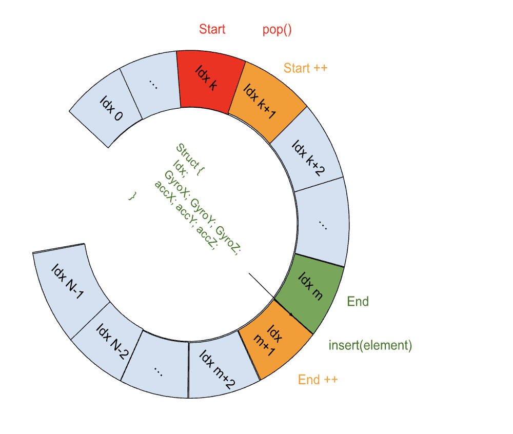
</p>
<p align="center"><strong>Figure 9: </strong> Diagram and Mechanism of the cyclic queue</p>

The sensory data is stored in a cyclic queue with a maximum capacity of N elements. The purpose of the queue is to allow O(1) insertion and deletion of sensory data. Moreover, a queue allows two concurrent threads to add and remove element from the queue without causing signiticant race conditions that'll corrupt the memory. The queue is a datastructure made up of a buffer as a continuous chunk of memory, am index counter that indicate the index of the first element of the queue in the memory array, and the index counter that indicate the block after the last element of the queue in the array
```c
typedef struct {
    SensoryData_t data[BUFFERSIZE];  // Array to store data
    int front;             // Index of the front element
    int rear;              // Index of the rear element
    int count;             // Number of elements in the queue
    int queue_start_idx;
    int queue_end_idx;
} GyroQueue_t;
```
The storage queue is a chunk of memory of $N \times sizeof(SensoryData)$  . We use the start index and the end index to store the start and end element of the queue. Each time a new element is inserted, we update the end of the queue as $(endIndex + 1) \pmod N$. If the queue is Full, we pop the least recently inserted element from the queue by updating the start index to $(startIndex + 1)  \pmod  N$. Below are the implementation of insertion and deleting element (the 6 axis gyroscope data) into and from the queue after checking if the queue is Empty or Full
```c
int enqueue(GyroQueue_t* queue, SensoryData_t* input_data) {
    if (isFull(queue)) {
        return 0;  // Queue is full
    }
    queue -> data[queue -> rear] = *input_data;            // Add element to the rear
    queue -> rear = (queue -> rear + 1) % BUFFERSIZE;  // Update rear (wrap around)
    queue -> count++;                         // Increase element count
    queue -> queue_end_idx = input_data -> idx;
    return 1;
}
```
```c
// Dequeue an element
int dequeue(GyroQueue_t* queue, SensoryData_t* output_data) {
    if (isEmpty(queue)) {
        return 0;  // Queue is empty
    }
    SensoryData_t output_data_tmp = queue->data[queue -> front];           // Get the front element
    
    output_data -> idx = output_data_tmp.idx;
    output_data -> gyro_Angular_X = output_data_tmp.gyro_Angular_X;
    output_data -> gyro_Angular_Y = output_data_tmp.gyro_Angular_Y;
    output_data -> gyro_Angular_Z = output_data_tmp.gyro_Angular_Z;
    output_data -> gyro_X = output_data_tmp.gyro_X;
    output_data -> gyro_Y = output_data_tmp.gyro_Y;
    output_data -> gyro_Z = output_data_tmp.gyro_Z;

    queue -> front = (queue -> front + 1) % BUFFERSIZE;  // Update front (wrap around)
    queue -> count--;                         // Decrease element count
    if (queue -> count > 0) {
        queue -> queue_start_idx = queue->data[queue->front].idx;
    }
    return 1;
}
```
In the main calculation loop, we keep popping elements from the queue and compare with the previous element that we popped. We use a flag ```Recog``` initialized to be 0 to indicate whether we’re collecting data for pose recognition. If $Recog == 1$, we place the new data into a buffer that we use for performing pose recognition. If the new data is not continuous in index 
$(IndexNew \neq Indexold + 1) $  with the previous data, we clear the buffer and set the flag ```Recog``` to be 0

If the new data has an index that’s continuous with the previous data, we consider the below 3 cases:

- If we’re currently not in Recog mode and the new data is similar to the previous data, we think of the wand in a stable state as the user is not waiving it for pose recognition. In this case, we simply update the previous data and don’t do anything
- If we’re currently not in Recog mode and the new data is vastly different from the previous data, we enter the Recog mode by setting ```Recog=1, STABLETIMEGAP =0```
- If we’re currently in Recog mode, we add the new data to a buffer for vectorized pose recognition.  
  - If the new data is similar to the previous data, we increment the stable time counter by 1 ```(STABLETIMEGAP++)```
  - If the wand sensors are stable for a long period of time ```(STABLETIMEGAP > Threshold)```, we think the user has finished waving the wand and set ```Recog = 0```

### Pose Recognition Algorithm
After we enter and quit the ```Recog ``` by setting the flag to be 1 and then back to 0, we’ve stored the time sequence data into an array for pose recognition. We currently conduct pose recognition using a version of thresholding according to the sharpe-turns recognized in the series data. This method is shown to be quite effectively and more importantly, deployable to be performed in realtime on the edge compared to Deep Learning algorithms (which are not practical to be implemented on such a lightweight platform given the amount of effort we'll need)

Specifically, we measures the number of sharp turns as fingerprints  to classify the pose recognition into different types of commands. Consider the two neighboring data ```D1, D2``` where ```D2.idx=D1.idx + 1```, we think of they have a sharp turn if 

$$\sqrt{(D1 .GyroX - D2.GyroX)^2 +(D1 .GyroY - D2.GyroY)^2 + (D1 .GyroZ- D2.GyroZ)^2} \leq Threshold$$

Based on the number of sharp turns found in the buffer, we could classify the waving action into drawing different shapes in the air. Below are samples of recognizing triangles and quadrilaterals

<p align="center">
    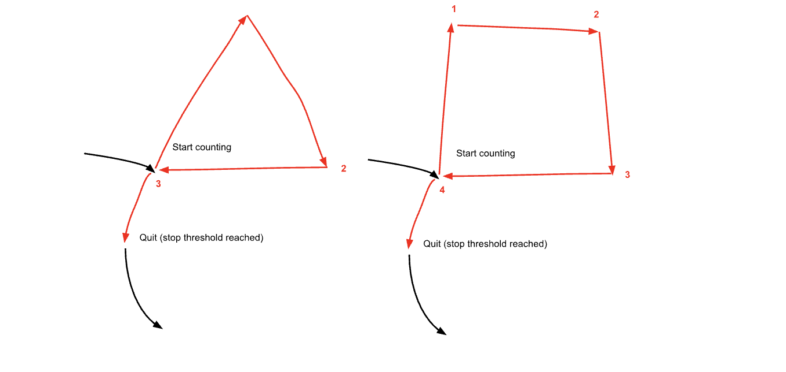
</p>
<p align="center"><strong>Figure 10: </strong> Example of Pose Recognition</p>


The implementation of the above formula is illustrated below
```c
static int compute_angular_Change(SensoryData_t* prior_data, SensoryData_t* current_data) {
    int d_angular_x = current_data -> gyro_Angular_X - prior_data -> gyro_Angular_X;
    int d_angular_y = current_data -> gyro_Angular_Y - prior_data -> gyro_Angular_Y;
    int d_angular_z = current_data -> gyro_Angular_Z - prior_data -> gyro_Angular_Z;
    int angular_shift = sqrt(d_angular_x * d_angular_x + d_angular_y * d_angular_y + d_angular_z * d_angular_z);
    return angular_shift;  
}
```

To further improve the throughput of calculation, we improved the procedure of taking elements from the queue and performing classification into one function, where we constantly keep track of the previously popped element from the queue and compare it with the new element for angular shift. If we're currently in counting ```Recog==1``` mode, we increment the number of sharp turns by 1. 

```c
static int execute_calculations(SensoryData_t* current_data, SensoryData_t* prior_data) {
    if (!dequeue(GyroQueue, current_data)) {
        // the queue is currently empty
        return -1;
    } else {
        //the queue is not empty
        int result = -1;
        int prior_idx = prior_data -> idx;
        int current_idx = current_idx -> idx;
        if (current_idx != prior_idx + 1) {
            // discontinuous cnt caused by package loss, replace the PriorSensory data with new data
            copy_sensory_data(current_data, prior_data);
            if (TRACKING) {
                STABLETIMEGAP += current_idx - prior_idx;
            }
        } else {
            // the data is purely continuous
            int angular_shift = compute_angular_Change(prior_data, current_data);
            if (angular_shift > ANGULAR_THREHSOLD) {
                if (TRACKING) {
                    STABLETIMEGAP = 0;
                    SHARPTURNCOUNTER += 1;
                } else {
                    TRACKING = 1;
                    STABLETIMEGAP = 0;
                    SHARPTURNCOUNTER = 0;
                }
            }
            copy_sensory_data(current_data, prior_data);
        }
        if (STABLETIMEGAP > GAP_TILL_EXIT) {
            result = SHARPTURNCOUNTER;
            //reset the time gap to be zero to allow restarting
            STABLETIMEGAP = 0;
            return result;
        }
    }
}
```
This will ensure a high throughput of recognition to be much smaller than the gap of sampling data from IMU, which avoid data stagnation. 


### Wireless communication

Simply put, we use an ESP32 and Nano 33, both connected to an ATmega, for wireless communication, as they are equipped with Wi-Fi modules. The Nano 33 recognizes hand gesture commands and transmits them to the ESP32 via Wi-Fi. The ESP32 then sends the commands to the ATmega328Pb through SPI.

We set up a private network, configuring the ESP32 and Nano 33 to be on the same local network. Each device is assigned its own IP address, which we define in the code for both transmitting and receiving functionalities. This setup ensures continuous communication between the devices.

#### ESP32(Reciever)

1. Declaring Wi-Fi Credentials
The code defines the SSID and password of the Wi-Fi network as constants:
```c
const char* ssid = "R9000P";
const char* password = "12348765";
```
These variables store the network name (ssid) and its corresponding password (password) required to connect to the Wi-Fi.

2. Setting Up a Wi-Fi Server
A Wi-Fi server is initialized to listen on a specific port (1234 in this case):
```c
const uint16_t port = 1234;  // Port to listen on
WiFiServer server(port);
```
The WiFiServer object, server, will handle incoming client connections on the defined port.

3. Wi-Fi Connection
The connectToWiFi function establishes the connection to the specified Wi-Fi network:
```c
void connectToWiFi()
{
    WiFi.begin(ssid, password);  // Start connecting to the Wi-Fi network
    while (WiFi.status() != WL_CONNECTED)  // Wait until the connection is established
    {
        delay(1000);  // Retry every second until connected
    }
}
```
WiFi.begin(ssid, password) initiates the connection to the Wi-Fi network using the provided credentials.
The while loop ensures the program waits until the device is connected to the network by continuously checking the connection status (WiFi.status() == WL_CONNECTED).

4. Starting the Wi-Fi Server
In the setup function, after the Wi-Fi connection is established, the server begins listening for client connections:
```c
server.begin();
```
5. Handling Client Connections
In the loop function, the server checks for incoming client connections using server.available():
```c
WiFiClient client = server.available();
if (client)
{
    // Wait for and process client data
}
```
If a client connects, the server enters a loop to listen for data sent by the client.
Once the communication ends, the client connection is stopped using client.stop().

#### Nano33(Send)

Similarly, we first need to declaring Wi-Fi Credentials as we did before. The code is same. The core parts are:

1. Server Configuration
The script defines two servers with corresponding IP addresses and ports:
```c
const char server_esp32[] = "192.168.137.156";
const uint16_t port_esp32 = 1234;

const char server_py[] = "192.168.137.218";
const uint16_t port_py = 1234;
```
server_esp32 and server_py represent the server addresses for communication with the ESP32 and a Python server, respectively.
port_esp32 and port_py specify the ports to be used for the connections.

2. Connecting to Servers
The connectToServer function handles the connection to a specified server:
```c
bool connectToServer(WiFiClient* client, const char * server, const uint16_t port)
{
    if (DEBUG)
    {
        Serial.print("Connecting to server ");
        Serial.print(server);
        Serial.print(":");
        Serial.println(port);
    }

    if ((*client).connect(server, port))  // Attempt connection
    {
        if (DEBUG)
            Serial.println("Connected to server!");
        return true;  // Connection successful
    }
    else
    {
        if (DEBUG)
            Serial.println("Connection to server failed.");
        return false;  // Connection failed
    }
}
```
Uses a WiFiClient object to establish the connection.
Checks and logs the connection status for debugging.

3. Sending Messages
The sendMessage function sends data to the connected server:
```c
void sendMessage(WiFiClient* client, const char* message)
{
    if ((*client).connected())
    {
        if (DEBUG)
        {
            Serial.print("Sending: ");
            Serial.println(message);
        }
        (*client).println(message);  // Send the message
    }
    else
    {
        if (DEBUG)
            Serial.println("Client not connected. Cannot send message.");
    }
}
```
Verifies that the client is connected before sending a message using println.

### Hardware requirement Specification

1. HRS01: The motor can successfully turn on and off the designed door
Validation:<video controls src="c8bd6ba754d37293bde818de6f6845ea.mp4" title="Title"></video>

2. HRS02: The LED lights on the wand can respond to different commands with various effects, achieving flowing light effects instead of just functioning as a basic on/off LED.
Validation: <video controls src="c8bd6ba754d37293bde818de6f6845ea.mp4" title="Title"></video>

### Software requirement Specification

1. SRS01:Able to successfully recognize different gestures.
Validation:<video controls src="c8bd6ba754d37293bde818de6f6845ea-1.mp4" title="Title"></video>

2. SRS02: Achieve a response time under 200 ms, allowing users to feel immediate feedback from devices.
Validation:<video controls src="c8bd6ba754d37293bde818de6f6845ea-2.mp4" title="Title"></video>

3. SRS03: Successfully achieve wireless communication
Validation: <video controls src="c8bd6ba754d37293bde818de6f6845ea.mp4" title="Title"></video>

### Summary

We successfully completed all our goals and designs on time. From wireless communication to gesture recognition and data processing, we met the requirements and objectives we initially set. However, there are still areas for improvement:

- LED Strip Effects: The LED strip effects we implemented using bare C are quite limited. In the future, we can explore adding more effects and flashing patterns to more realistically simulate the spell-casting process.

- Gesture Recognition: We opted against using ML-based methods due to limited on-device computational power. Instead, setting thresholds allowed us to achieve the desired performance. For more complex gestures, we could consider transmitting data to a computer via Wi-Fi for processing and then sending it back. However, this would increase both development time and response latency. As a result, the threshold-based method remains the most optimal solution for now.

- Smart Furniture Models: We can enhance the furniture model by integrating more smart devices to expand functionality.

These improvements would make the system more robust and feature-rich.

## Sprint review 2

### Current state of project
The team has made substantial progress on several critical tasks this week, continuing to move closer to achieving our project goals. Key developments include successful communication with sensors, early stages of wireless module integration, and preparations for component integration testing. Our focus is on refining individual components, with a special emphasis on ensuring compatibility across the different hardware modules. We are on track to integrate these modules in the upcoming sprint

### Last week's progress 

#### Current State Overview
This week, the team has made excellent progress, achieving several important milestones. Notably, we have successfully tested and integrated key hardware communication methods, including wireless communication, sensor data reading, and LED control. As we prepare for component integration, the next focus will be on comprehensive testing and ensuring the modules work cohesively. We are on schedule to advance to full system integration in the next sprint.

#### Nano 33 IMU & Gyroscope Check
* Description: This task involved figuring out how to read data from the onboard IMU & Gyroscope of the Nano 33 device.
* Status: Completed
* Outcome: The team successfully figured out the communication method with the IMU & Gyroscope. Using the bare-metal code approach, the device now * correctly outputs data from the IMU & Gyroscope. A fallback method using the appropriate libraries was also considered, but was not needed since * the communication was established. We have some successful data output under ./data/nano33_gyroscope_IMU_data. 
* Time Spent: 6 hours

Gyroscope Reading


#### Investigation of ESP32 on Atmega328
* Description: The goal was to familiarize ourselves with the ESP32 module, with an eye toward establishing wireless communication.
* Status: Completed
* Outcome: The team successfully investigated communication protocols like SPI and UART. The ESP32 now communicates with the Atmega328pb for data transmission, and the best protocol for communication with the Nano 33 was identified. 
* Time Spent: 3 hours

[](videos/light1.mp4)

#### LED Light Strip Configuration
* Description: This task aimed to write code for controlling an LED light strip.
* Status: Completed
* Outcome: The team successfully wrote bare-metal C code to control the LED light strip, allowing for changes in color and brightness. The LED strip now functions as expected, which will be useful for providing visual feedback during testing and future project phases. The code has been written into library under ./328pb/lib/ws2812b_control. 
* Time Spent: 5 hours


[](videos/light_serial.mp4)

#### Develop Testing Plan for Integration
* Description: This task focused on creating a testing plan for integrating various components of the project, especially posture recognition and Bluetooth modules.
* Status: Completed
* Outcome: The testing plan was completed, outlining key test cases and success criteria for each integration point. The plan includes evaluating posture recognition accuracy, Bluetooth communication stability, and power management efficiency during integration. This will be critical for the next steps of the project as we begin integrating the components.
* Time Spent: 3 hours


#### Wireless communication is achieved
* Description: Successfully send the data from nano33 to another device connected to the same Wifi, testing the functionality of the wireless communication. Send and receive are achieved
* Status: Completed
* Outcome:  Wireless communication between the Nano 33 and the connected device was successfully established. The team was able to send and receive data, validating the functionality of the communication link. This achievement sets the foundation for future wireless interactions in the project.
* Time Spent: 6 hours


### Next week's plan

#### Task: Construct dataset for gyroscope classification 
* Description: Record and label  dataset from readings of gyroscope when drawing different gestures, including but not limited to squares, circles, triangles, etc
* Estimated Time: 5 hours
* Assigned to: Yudong Liu
* Definition of Done: Record at least 20k lines of data, such that each line of data corresponds to a set of 3-axis gyroscope sampled data.
* Detailed Description: We connect nano33 to the serial port and write to a log file while we waive the wand. To figure out the start and end of the gesture during the recording process, we use a program to insert a breakpoint to the logfile through pressing a key at the start and end of each gesture. We use a continuous time-series 2-3 seconds of data  for each instance of gesture. 

#### Task: Investigate the naive algorithm of classifying simple shapes such as circles, squares, triangles, etc as gestures
* Description: Write and test an algorithm that uses a thresholding method for pos recognition
* Estimated Time: 2 hours
* Assigned to: Yudong Liu
* Definition of Done: Being capable of distinguishing square, circle and triangular shapes through thresholding on the time-series data of the gyroscope
* Detailed Description:  Write a function that takes the sequence of 3 axis data as input, and accumulates over a period of time (maximal 3 seconds in the past) to identify possible signs of different postures (number of sharp turns or a periodic circular movement for example).

#### Task: investigate the machine learning based algorithm for pos-recognition
* Description: write and test a model (such as KNN) for mapping poses to a embedding vector 
* Estimated Time: 5 hours
* Assigned to: Yudong Liu
* Definition of Done: Write code to perform mapping of time-series pose data to a vector after denoising and report the accuracies of random pose generation
* Detailed Description: When testing, connect the wand to a desktop through either wifi or bluetooth, send the raw data (3 axis gyroscope data) series to the desktop for matrix calculation after concatenation.

#### Task: Test control mechanisms of the wand
* Description: Decide and store different ground truth gestures on the LEDs and motors (the smart home setting) to operate based on instructions of the wand
* Estimated Time: 6 hours
* Assigned to: Guanlin & Jiajun
* Definition of Done: If the wand sends out the correct instructions, the devices in the smart home could operate as planned 
* Detailed Description:  Set up the hardware  and connect them to ATMega and ESP32. Write functions for controlling different devices. 

#### Task: Integration of the wand model and the home model
* Description: Put together the printed parts and laser-cutting parts and form a workable model
* Estimated Time: 10 hours
* Assigned to: Guanlin Li & Jiajun Chen & Yudong Liu
* Definition of Done: model should work as written in the expectation of this project. 
* Detailed Description:  Integrate different parts together, install the motor, light and pump to the home model, install the led strip, nano33 and battery onto the wand. 

## Sprint review #1

### Current state of project


This week, we completed the draft design for the home model, which was showcased successfully. However, due to the unavailability of actual components, we could not measure dimensions and therefore have not yet designed the wand model. We secured access to the RPL lab and are currently evaluating options to either 3D print the home model or use laser cutting to assemble the basic shell as soon as possible. Additionally, we studied the Nano 33 datasheet to understand Bluetooth communication and the IMU module, ensuring that future communication between wands can be implemented effectively.
Current Status

The project is making steady progress with key foundational tasks completed and a clear roadmap for upcoming activities. The home model design has been finalized, and we are preparing for its physical prototyping through either 3D printing or laser cutting. Access to the RPL lab has been obtained, facilitating the next steps for hardware assembly. While the wand model design is pending due to the absence of necessary components for measurement, we have advanced in understanding the technical aspects of the Nano 33, including Bluetooth communication and the IMU module. Additionally, we tested the basic communication capabilities of the Nano 33 by successfully controlling an LED light via remote commands. This lays a solid groundwork for implementing inter-wand communication in the future. The focus now is on transitioning from design to prototyping and integrating hardware and communication systems.

### Last week's progress 

#### Completed the Planned Tasks of the last week

* Finalize and order remaining components, ensure all required parts are in stock and accounted for.
* Document all decisions, discussions, and tasks completed to date in a mini-report.
* Create a testing plan for integrating components once all are available, especially focusing on posture recognition and Bluetooth modules.
* Identified new items to be added to our procurement list.

#### Still In Progress:
* Initial Integration of Nano 33 MCU
* Begin setting up the Nano 33 MCU for posture recognition, test Bluetooth communication and gyroscope integration.

We are still working on the posture recognition Test and reading the data sheet of the Nano 33. We are planning to fix basic posture recognition next week and make a demo trial test on Nano 33.

#### Extra Work:

##### 1. Home Model Design and Get the Access to 3D printer

* Finished the basic construction of the home model in SolidWork
* Getting the access to RPL Lab and the Venture Lab for printing our model in the future

##### Proof of Work:

* GitHub Commits: Update Model File

* Proof of Access to the RPL Lab and the Venture Lab

#### 2.Nano 33 Data Sheet Reading and Basic Function Test

* Finished part of reading of the Bluetooth Communication using nano33
* Tested the wireless control ability via simple demo: turning on and off LED.

##### Proof of Work:

* The followings are part of the demo code:

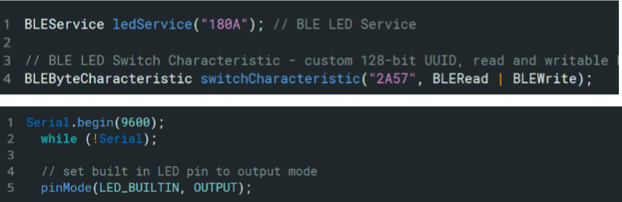
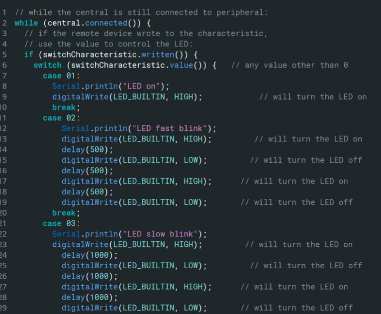

Test Existing implementation for gyroscope data reading

#### Serve Motor Test

* Tested the functionality of the motor based on the datasheet
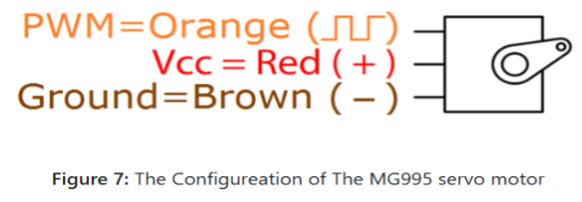
* It successfully works using ATm328P to control.

#### Proof of Work:

* GitHub Commits: Update Model File
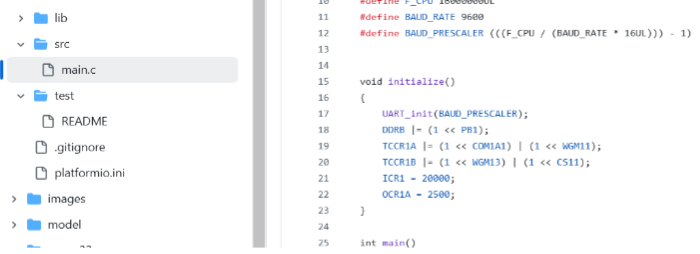
Our motor can function properly.

#### LED strip Test

Have tested the functionality of the LED strip. 
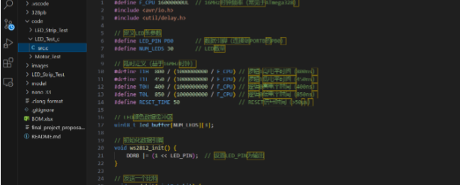
### Next week's plan

#### Task: Nano 33 IMU&Gyroscope check

* Description: Figure out how to read data from IMU&Gyroscope from the onboard device of Nano 33. 
* Estimated Time: 6 hours
* Assigned to: Guanlin & Jiajun & Yudong Liu
* Definition of Done: Nano 33 successfully prints out correct data from IMU Gyroscope. 
* Detailed Description: Read through the implemented code and datasheet to try to figure out the way to communicate with the sensor using bare metal code. If failed, use the library & make sure every part of the library is understood. 

#### Task: Investigation of ESP32 on Atmega328

* Description: Familiar with ESP32 module on Atmega328pb for further wireless communication.
* Estimated Time: 6 hours
* Assigned to: Jiajun & Li Guanlin
* Definition of Done: ESP32 can successfully communicate with Atmega328pb, including receiving and sending data
* Detailed Description: investigate different communication protocols including SPI and UART and find the best way to communicate with Nano33.

#### Task: LED light strip configuration

* Description: write a module to control the LED light strip
* Estimated Time: 5 hours
* Assigned to: Guanlin Li & Yudong Liu
* Definition of Done: A code that can control the color and brightness of the LED strip. 
* Detailed Description: Implement the code using bare metal C and successfully control the LED light strip to display different colors. 

#### Task: Develop Testing Plan for Integration

* Description: Create a testing plan for integrating components once all are available, especially focusing on posture recognition and Bluetooth modules.
* Estimated Time: 3 hours
* Assigned to: Liu Yudong
* Definition of Done: Testing plan is completed, including test cases and success criteria for integration of key modules.
Detailed Description: Outline test cases, methods, and success criteria for each integration point, including posture recognition accuracy, Bluetooth stability, and power management.

## Sprint review trial

### Current state of project

We finalized the selection of necessary components, including in-depth discussions and considerations for specific details such as the power supply, MCUand IMU&Gyroscope module. 

Additionally, we updated our project implementation approach and identified new items to be procured. For the posture recognition module, we optimized the use of the gyroscope and decided to incorporate a new MCU, the Nano 33, which combines Bluetooth communication and a gyroscope, allowing us to reduce costs. This decision was reached after extensive discussions within the team and the TA’s advise. We also clarified the allocation of responsibilities among team members, completed the project contract, strengthened team cohesion, and established our final objectives.

### Last week's progress 

#### Component Selection

* Finalized the necessary components and discussed specific elements like power supply requirements.
* Updated our approach to implementing the project based on these component choices.
* Identified new items to be added to our procurement list.

#### Posture Recognition Module

* Selected a new MCU, the Nano 33, which integrates Bluetooth communication and a gyroscope, reducing costs. This decision was made after extensive team discussion.

#### Team Coordination and Planning

* Finalized the allocation of responsibilities among team members.
* Completed the project contract, reinforcing team cohesion and clearly defining our objectives.

#### Proof of Work:

* GitHub Commits: Update BOM for hardware of this project. 
* Mini-reports: Discussions on power supply and component optimization in the project repository. 
* Observations: Realized that using the Nano 33 would allow cost savings and simplify Bluetooth integration, based on team discussions and testing.
  
#### Hardware Status

* Most of the required components have been selected and submitted for purchase, including backups where necessary.
* Testing of currently available components has shown that they are working as expected.

### Next week's plan

#### Task: Ordering and Inventory Check

* Description: Finalize and order remaining components, ensure all required parts are in stock and accounted for.
* Estimated Time: 2 hours
* Assigned to: Jiajun Chen
* Definition of Done: All required components, including backups, have been ordered and an updated inventory list is created.
* Detailed Description: Confirm the purchase of additional components identified this week and update the inventory to reflect all items needed for the project.

#### Task: Initial Integration of Nano 33 MCU

* Description: Begin setting up the Nano 33 MCU for posture recognition, test Bluetooth communication and gyroscope integration.
* Estimated Time: 4 hours
* Assigned to: Liu Yudong & Li Guanlin
* Definition of Done: Nano 33 is successfully integrated with initial posture recognition tests and Bluetooth communication functioning.
* Detailed Description: Install and configure the Nano 33, set up Bluetooth communication, and perform initial tests to confirm it meets project requirements.

#### Task: Documentation of Current Progress

* Description: Document all decisions, discussions, and tasks completed to date in a mini-report.
* Estimated Time: 3 hours
* Assigned to: Jiajun Chen & Guanlin Li
* Definition of Done: A detailed report summarizing current project status, decisions made, and progress on each component and task.
* Detailed Description: Create a structured document that includes updates on component choices, hardware testing results, and team discussions on implementation strategy.

#### Task: Develop Testing Plan for Integration

* Description: Create a testing plan for integrating components once all are available, especially focusing on posture recognition and Bluetooth modules.
* Estimated Time: 2 hours
* Assigned to: Liu Yudong
* Definition of Done: Testing plan is completed, including test cases and success criteria for integration of key modules.
* Detailed Description: Outline test cases, methods, and success criteria for each integration point, including posture recognition accuracy, Bluetooth stability, and power management.


## Final Project Proposal

### 1. Abstract

Home automation is increasingly transforming modern households with smart technology, enabling users to control and monitor their home environment conveniently. The goal of the team's project is to design and construct an innovative home automation centered around an interactive smart wand, leveraging the strengths of teamwork and technical expertise. The project's design scheme includes an integrated electronic system that supports a range of functions, allowing users to control household devices such as lights, doors, and pet water dispensers through customized wand gestures and commands wirelessly. The project is carried out by the team, each contributing to various aspects of the design, with the flexibility to choose hardware components within a specified budget.

### 2. Motivation

The rapid development of smart technology has revolutionized the way people interact with their living spaces, providing convenience, efficiency, and enhanced control over daily tasks. However, traditional interfaces like mobile apps or voice commands can sometimes feel impersonal or cumbersome, especially for users looking for a more intuitive and engaging experience. Inspired by the concept of bringing magic into everyday life, the team's project aims to create a novel approach to home automation through a wand-based control system. This allows users to interact with household devices—such as lights, doors, and pet water dispensers—through simple, magical gestures. By combining the familiarity of Bluetooth and Wi-Fi technology with an innovative control interface, the team's goal is to make smart home devices more accessible, enjoyable, and efficient, transforming ordinary tasks into experiences that feel both magical and practical.

### 3. Goals

Using gesture and pose recognition algorithms, the team aims to achieve convenient and smooth control of all home equipments through the wand. This would require capturing movements of users through sensors on the wand and matching them effectively with the "fingerprint" movements previously recorded for performing each action. To achieve this, the team need to integrate controlling units from both the wand and devices the team aims to control in a wireless setting. 

To summarize, the primary objective of the project is to develop a wand-controlled smart home system capable of Bluetooth and Wi-Fi communication with compatible devices, bringing a seamless and engaging experience to users. The system comprises microcontrollers, communication modules, and sensors to achieve reliable interaction with various smart home components. The wand utilizes an ESP32 microcontroller and a Bluetooth module to manage Wi-Fi and Bluetooth communication, LED feedback, and gesture recognition, while the home devices - such as lights and doors - are equipped with Wi-Fi and Bluetooth modules to enable smooth connectivity.

### 4. System Block Diagram
<p align="center">
    
</p>
<p align="center"><strong>Figure 1: </strong> Block Diagram of The Wand System</p>


### 5. Design Sketches

<p align="center">
    
    
</p>

<p align="center">
    <strong>Figure 2:</strong> The Design Schetch
</p>

### 6. Software Requirements Specification (SRS)

#### 6.1. Overview

The smart home controller system allows users to control home appliances, specifically lights and doors, using pose recognition derived from gyroscope and IMU data when the user is waving the wand. The system processes sensor data to recognize gestures and sends commands over Wi-Fi and bluetooth to perform predefined actions on connected devices. The software part of the design include algorithm for pose recognition based on gyroscope and IMU data, communication between the wand and smart devices, and control mechanims of smart devices using the same MCU.

The team's target audiences are smart home users who prefer voiceless remote control of all devices. Traditionally, smart home systems are managed through touch interfaces, voice commands, or smartphone applications, but these control methods may not be universally accessible or convenient. Therefore, the team introduces the wand as a universal agent for effortless smart home management.

A detailed description of software requirements of different features are provided below. 

#### 6.2. Pose Recognition

The system shall process gyroscope and IMU data to identify specific user gestures for controlling appliances. The system shall recognize at least three distinct poses for each action:

- Turn on/off lights. 
- Open/close doors. 
- Open/close pumps. 

The team plans to use pattern similarity matching algorithms to perform pose recognition of waving the wand. The team starts recording the gyroscope and IMU data when witnessing a rapid change in captured acceleration by the sensor. The accuracy of recognition should exceed 80%. If traditional methodologies are not applicable, the team could also try Machine Learning based approaches to perform classification task on different posture commands of waving the wand from gyroscope and IMU data. 

#### 6.3. Communication

Communication is a critical part of the project since the wand needs to send commands to the smart devices using wireless communication protocols. The team decided to choose bluetooth and Wi-Fi due to its wide usage and the mature technology ecosystem supporting it.

- The wand shall connect to the Wi-Fi network within a 10-meter radius. 
- The wand shall send commands to the smart devices after the command has been generated. 
- The wand should be able to send commands to other bluetooth devices. 
- The peripheral control unit shall correctly receives the commands. 

#### 6.4. Device Control

In order to control devices effectively in the smart home setting, the system shall be able to: 

- Turn lights on and off upon gesture detection .
- Control motors to open and shut the door close upon gesture detection. 
- Control the pump to start and stop pumping water upon gesture detection. 

Both of the above actions could be achieved through the use of PWM, I2C, UART or simple GPIO output on the MCU that controls the smart home devices. Additionally, the system shall send feedback to the user indicating successful pose extraction and action execution or error messages if the action fails. 

#### 6.5. Error Handling

In order to provide users with feedback on each command and action, the team also plan to integrate error handling mechanisms. The error handler should have the following functionalities: 

- The system shall retry commands up to three times if initial wireless transmission fails.
- The system shall log errors for failure analysis and debugging.
- If a pose is unrecognized or a transmission has failed, the system shall notify the user by blinking LED stip on the wand and prompt to retry. 


### 7. Hardware Requirements Specification (HRS)

#### 7.1 Overview

The hardware design and implementation of the team's wand-controlled home automation system consists of multiple integrated components to enable seamless control over smart home devices. The primary hardware structure includes modules for gesture recognition, wireless communication, and device-specific control mechanisms. 

At the core of the team's system is the ESP32 microcontroller, responsible for transmitting data from the wand to various peripheral devices. The ESP32 works alongside the ATmega328PB, which serves as the main controller for both the wand and the peripheral controllers. These microcontrollers coordinate the data flow and manage command execution. 

For gesture recognition, the GY-521 IMU & Gyroscope module detects hand movements, allowing the wand to accurately interpret gestures, such as circles and triangles, for controlling different smart devices. To provide users with feedback during command execution, an LED strip is integrated into the wand, acting as a visual indicator.

Device-specific modules are included to enable interaction with household components: the MG995 servo motor for door control, a water pump for the pet water dispenser, and an HC-05 Bluetooth module for establishing communication between the wand and other Bluetooth-enabled devices. 

To showcase these functions, a 3D-printed home model with embedded responsive devices was created, allowing for realistic testing and demonstration of the wand’s capabilities within a simulated environment. This setup enables the team to fine-tune hardware performance and ensure smooth, reliable operation in a practical setting.

#### 7.2 Power Source

The power supply for the home automation system is provided by three 1.5V AA alkaline batteries connected in series, offering a total source voltage of 4.5V. This power configuration was chosen due to restrictions on lithium battery usage, as well as the need for a reliable and safe energy source suitable for indoor applications. The 4.5V output is sufficient to power the low-voltage modules in the system, including the ATmega328PB microcontrollers, IMU and gyroscope module, and the Bluetooth module, which operate efficiently within this range. The team plans to build a voltage divider for the ESP32 board, which takes in a voltage of 3.0-3.6V. 

Compared to single-cell batteries, the series connection provides a stable and sustained voltage, which enhances the consistency of control signals for the smart devices. Alkaline batteries were selected not only for their accessibility and ease of replacement but also for their low risk of overheating and high compatibility with consumer electronics. This choice supports both safety and user convenience, making it easy for users to replace batteries as needed.

A key consideration in this setup is the overall power management, especially given the continuous operation of modules such as the Bluetooth, Wi-Fi, and IMU components. To mitigate potential issues with voltage drops, capacitors are placed in parallel with critical components to smooth the power supply and stabilize voltage levels during sudden power demands, such as during Bluetooth transmission or LED strip activation.

The stability and longevity of the alkaline battery source have been tested to meet the expected usage cycle of the system, ensuring continuous operation without frequent replacements. Further analysis of the power source's performance will be discussed in the Results & Discussion section.

The team plans to power the devices in the home model with a 120v AC to 5v DC converter. This suits the realistic home scenario and could provide the smart devices with a steady power source. 

#### 7.3. The ATmega328PB Board

The ATmega328PB microcontroller is critical to the data processing and command execution within the team's wand-controlled home automation system. On the wand, the ATmega328PB reads rotation and acceleration data from the GY-521 IMU & Gyroscope module, interpreting these inputs as gesture commands. It then sends the processed commands to the ESP32 or bluetooth module for wireless transmission to various devices. 

On the peripheral control unit, a separate ATmega328PB serves as the controller for various home automation devices, including the light bulb, servo motor (for door control), and water pump (for the pet water dispenser). This microcontroller listens for incoming commands from the ESP32 and directly controls the connected devices to execute the desired actions. 

#### 7.4. The ESP32 Board

The ESP32 board on **the wand** shall be able to transmit every command it reads from the ATmega328PB board on **the wand** to the other ESP32 board installed on the peripheral control unit. 

The ESP32 board on **the peripheral control unit** shall be able to send every command it receives from the other ESP32 board to the ATmega328PB board on **the peripheral control unit**. 

#### 7.5. The Bluethooth Module

The Bluetooth communication in the team's home automation system is facilitated by the HC-05 Bluetooth module, which enables wireless data transfer between the wand controller and various Bluetooth-enabled home devices. This module was selected for its ease of integration, reliable connectivity, and compatibility with microcontrollers such as the ATmega328PB and ESP32 used in the team's setup.

The HC-05 operates within the standard Bluetooth 2.0 protocol, offering a stable connection range of up to 10 meters in indoor environments, which is ideal for home automation scenarios. It supports UART (Universal Asynchronous Receiver/Transmitter) communication, which allows seamless data transmission with microcontrollers at a configurable baud rate. In the team's design, the baud rate is set to 9600 bps to ensure a balance between transmission speed and stability, critical for real-time control of smart devices.

<p align="center">
    
</p>
<p align="center"><strong>Figure 3: </strong> The Bluetooth Module Connection</p>

Powering the HC-05 requires a 3.3V - 6V input, which aligns with the output from the team's voltage-regulated power supply. The module's onboard voltage regulator and level shifter make it compatible with both 3.3V and 5V logic levels, simplifying integration with the ATmega328PB and ESP32 controllers. The HC-05’s low power consumption is essential for maintaining overall system efficiency, especially in a battery-powered setup, and contributes to the extended operational lifespan of the wand.

The HC-05 also provides flexibility for future expansion, allowing additional Bluetooth-enabled devices to be paired with the system. 

The module’s pairing and communication status are indicated by an onboard LED, which blinks during pairing and remains solid when a connection is established. This visual feedback ensures that users can easily confirm the connection status, improving the reliability and user-friendliness of the system. 

In summary, the HC-05 Bluetooth module is a critical component in enabling wireless communication across the smart home setup, providing reliable, low-power, and flexible connectivity for a smooth and responsive user experience.

#### 7.6. The IMU and Gyroscope Unit

The GY-521 IMU and Gyroscope Unit, featuring the MPU-6050 sensor, is responsible for detecting gestures and movements of the wand, enabling intuitive control over smart home devices. This module was selected for its high sensitivity and accuracy in motion detection, which is essential for recognizing specific gestures such as circles and triangles, which trigger commands for controlling devices like lights, doors, and pet water dispensers.

The MPU-6050 sensor integrates a 3-axis gyroscope and a 3-axis accelerometer, allowing it to detect both rotational motion and linear acceleration. This capability enables the wand to capture complex gestures with a high degree of accuracy. The sensor communicates with the ATmega328PB microcontroller on the wand through an I2C interface, which is configured at a standard data rate to ensure reliable data transmission with minimal latency.

Operating at a voltage range of 3.3V to 5V, the GY-521 is compatible with the power supply configuration of the wand, simplifying integration and ensuring stable operation. The module’s power consumption is optimized for battery-powered applications, which supports the overall energy efficiency of the system, prolonging battery life during continuous use.

<p align="center">
    
</p>
<p align="center"><strong>Figure 4: </strong> The Schematic Diagram of MPU-6050</p>

To achieve smooth and accurate gesture detection, the MPU-6050 is calibrated to filter out ambient vibrations and unintentional movements. The onboard Digital Motion Processor (DMP) of the MPU-6050 enables it to process complex motion algorithms directly on the sensor, reducing the computational load on the ATmega328PB and enhancing real-time response to user gestures.

The GY-521 module is mounted securely within the wand to minimize unwanted movement and ensure consistent data capture. Its sampling rate is set to provide real-time responsiveness to gestures, with minimal delay, ensuring an engaging user experience. The IMU data is processed by the ATmega328PB to interpret each gesture and send the corresponding control signal via the Bluetooth module to the designated home device.

By incorporating the GY-521 IMU and Gyroscope Unit, the wand is capable of accurately detecting and interpreting a variety of gestures, allowing users to control smart devices with intuitive motions. This setup not only enhances user convenience but also provides a novel and engaging method of interaction within the smart home environment.

#### 7.7. The Status Indicator

The Status Indicator is a crucial component of the wand, providing real-time visual feedback to users on the command they just executed. This feedback ensures that users can easily confirm whether their gesture was accurately recognized and translated into the intended action. To meet these requirements, the team selected the WS2812B LED strip, a highly versatile LED solution with individually addressable LEDs that allow precise control over color and brightness.

The WS2812B LED strip operates by controlling each LED individually via addresses, enabling the system to display distinct colors and patterns corresponding to different commands. For example, a specific color may indicate that the wand has successfully sent a command to turn on a light, while another color may indicate that a command to open the door was recognized. This level of customization ensures that the user can intuitively understand the wand’s status and feel confident about their interactions.

Operating at 5V, the WS2812B LED strip is compatible with the wand’s power supply and can be directly controlled by the ATmega328PB microcontroller, which sends data to the LED strip to dynamically adjust colors based on recognized commands. 

<p align="center">
    
</p>
<p align="center"><strong>Figure 5: </strong> The Internal Circuit of LED Strip</p>

In addition, the WS2812B supports a wide color range and fast response time, allowing it to provide smooth transitions and immediate feedback with minimal latency. This is particularly important in gesture-based control systems, where users expect instantaneous visual confirmation. The strip’s addressable nature also means that different sections of the LED strip can light up in different colors or patterns, offering further customization options to enhance the user experience.

<p align="center">
    
</p>
<p align="center"><strong>Figure 6: </strong> The Color Control of LED Strip</p>

By integrating the WS2812B LED strip, the status indicator effectively meets the requirement of providing clear, intuitive, and dynamic feedback, allowing users to seamlessly interact with their smart home devices and understand the wand’s operational state at a glance.

#### 7.8. MG995 servo motor

The MG995 servo motor serves as the core mechanism for controlling rotational movements required for opening and closing the door within the team's smart home automation system. The motor operates on direct current and is widely used in applications requiring precise angular control, such as robotic arms, pan-tilt mechanisms, and automated door systems. The MG995 motor features high torque and a metal gear structure, which provides enhanced durability and performance stability under continuous load. 

The motor includes three connection pins: power (VCC), ground (GND), and signal (SIG). The signal pin accepts PWM input signals to control the angular position of the servo arm, which can rotate between 0° and 180°. By adjusting the duty cycle of the PWM input, the motor’s position can be controlled with high precision, making it suitable for accurately managing the open and closed states of doors in a home setting.

<p align="center">
    
</p>
<p align="center"><strong>Figure 7: </strong> The Configureation of The MG995 servo motor</p>

The MG995 operates effectively within a voltage range of 4.8V to 7.2V, with an operating torque of 9.4 kg·cm at 6V, ensuring it has enough strength to manage typical household doors. The motor’s maximum stall current is 1.2A at 6V, which has been considered in the design of the power management system to prevent overloading. The motor’s position is updated every 20 ms based on the PWM signal, allowing smooth and reliable movement control.

<p align="center">
    
</p>
<p align="center"><strong>Figure 8: </strong> The PWM Setting of Motor Control</p>

To accommodate the MG995's power and stability requirements, the motor is connected to a dedicated PWM output channel on the ATmega328PB peripheral controller, which regulates the door’s opening and closing actions. This setup enables a controlled and stable door movement, while the microcontroller ensures the appropriate signals are sent based on user commands received via the wand’s Bluetooth connection.

For enhanced stability and durability, the MG995 servo motor integrates with a mount on the smart home model, allowing it to securely handle repeated opening and closing actions without loss of precision. The setup provides a robust and efficient solution for automated door control within the home automation system.

#### 7.9. Decoupling Ceramic Capacitor

Alongside the sophistication on the motor control circuit, the performance of motors has also been improved from another degree – the overall stability of the driving system. The practical approach to achieve better system stability is to add a decoupling capacitor to the circuit. To understand the functionality of decoupling capacitor, one should look into the internal structure of motors. The motors contain magnetic brush that might generate electromagnetic pulses. The pulses are likely to impair the circuit’s components, such as the microcontroller and motor control module. As the frequency of PWM power sources increases, the noise generated by the operating motors intensifies, and this is detrimental to the system. The decoupling capacitor aims to provide AC current flows near the load component to mitigate the detrimental effect of the noise. This capacitor is no simple capacitor: it contains equivalent se-
ries inductance (ESL) and equivalent series resistance (ESR), and the equivalent circuit arrangement can be depicted as shown in following figures. In this case, I1 is AC current source, and its frequency equals the PWM source frequency. If the overall capacitance of the circuit is sufficiently large to be com-
mensurate to a voltage source, the ESL and ESR are expected to be as small as possible to stabilize the circuit voltage. 

<p align="center">
    
    
</p>

<p align="center">
    <strong>Figure 9:</strong> Technical details regarding decoupling capacitors
</p>

The material of which the capacitor is made of is also one important consideration. In Figure, several capacitors that share the same capacitance but differ in materials are compared in terms of their impedance with changing frequency. In the figure, the lowest point on each curve corresponds to the resonance frequency of the capacitor, and at this point the impedance is the ESR. Conclusion can be drawn that the higher the resonance frequency, the lower the ESR; the lower the impedance, the lower the ESR. From these views, it can be indicated from the figure that ceramic capacitors outperform other capacitors in terms of ESR and ESL, so the author chooses a ceramic capacitor to decouple the circuit.

#### 7.10. The light bulb

The light bulb is only a demo, so the team plans to use part of the LED strip from the status indicator to represent the light bulb. 

#### 7.11. The pump

The Water Pump is designed to provide fresh water to pets as part of the home automation system. To meet this need, the team selected a pet water pump available on Amazon, chosen for its compatibility with remote control operations and reliability in consistent water delivery. When the power is turned on via a command from the wand, the pump is activated to dispense water for pets, ensuring an efficient and controlled flow.

Selected for its quiet operation and compact design, the pump ensures minimal noise disturbance and easy integration within the 3D-printed home model, allowing realistic testing and demonstration of the water dispensing function. The pump’s simple on/off functionality aligns with the pet care automation goals, providing fresh water with minimal supervision and user effort.

Additionally, the water pump’s motor is protected by a back-emf diode to prevent voltage spikes upon deactivation, thus preserving the longevity of both the pump and the control circuitry. This protection is especially critical, as the wand-controlled system may issue commands in quick succession, requiring the pump to respond without risk of hardware failure.

The inclusion of the water pump in this automation system supports a convenient and reliable method for pet hydration, demonstrating how smart home technology can enhance pet care routines as part of a connected home environment.

### 8. Components

**ATmega328PB**

Purpose: Serves as the core processing unit for both the wand and peripheral controllers, managing sensor data and controlling device-specific actions (e.g., light, door, and water pump). The ATmega328PB on the wand processes gesture data from the IMU and communicates with the ESP32 for Bluetooth commands.

**ESP32**

Purpose: Handles Bluetooth communication between the wand and home devices. The ESP32 allows for wireless control over multiple devices, enabling the wand to send commands to various wireless components in the home setup.

**IMU and Gyroscope**

GY-521 IMU (MPU-6050)
Purpose: This module provides 3-axis gyroscope and accelerometer data to detect the wand’s movements and gestures, such as circles or triangles, enabling intuitive command control. The IMU and gyroscope data is processed by the ATmega328PB to interpret each gesture and send the corresponding command via Bluetooth.

**Bluetooth Module**

HC-05 Bluetooth Module
Purpose: Allows the wand and home devices to communicate wirelessly. This module is used on both the wand and the home devices for seamless data exchange, which is crucial for controlling devices such as lights, doors, and water pumps.

**Status Indicator LED Strip**

WS2812B LED Strip
Purpose: Provides real-time feedback to the user by displaying different colors and patterns based on the gesture command being executed. The individually addressable LEDs allow dynamic color changes that correspond to specific wand commands.

**Servo Motor**

MG995 Servo Motor
Purpose: Controls the opening and closing of doors as part of the home automation setup. The MG995’s high torque allows it to operate reliably for controlling household doors, activated by commands from the wand.

**Water Pump**

Pet Water Dispenser Pump
Purpose: Pumps water for pet hydration when activated. Selected for its compatibility with small-scale, controlled water dispensing and quiet operation, making it suitable for home environments.

**Lighting**

12V Smart LED Bulb
Purpose: Provides smart lighting control in the home model, activated by commands sent from the wand. This bulb is compatible with Bluetooth control and enables various lighting effects, controlled remotely by the wand’s commands.

**Power Supply**

AA Alkaline Batteries (for Wand)

Purpose: Provides reliable power to the wand without the risk associated with lithium batteries. AA batteries are easily replaceable and compatible with the low-voltage requirements of the wand’s microcontroller and sensor modules.

**DC Power Supply (for Home Model)**

Purpose: Supplies stable power to components in the home model, such as the servo motor, water pump, and LED strip. This ensures consistent operation during testing and demonstration.

| Component            | Description                                                            | Link                                                                                                          | Datasheet                                                                                                                                                              | Number |
|----------------------|------------------------------------------------------------------------|---------------------------------------------------------------------------------------------------------------|------------------------------------------------------------------------------------------------------------------------------------------------------------------------|--------|
| ESP32                | controller for sending data from the wand to the peripheral controller |                                                                                                               | [datasheet](https://www.espressif.com/sites/default/files/documentation/esp32-s2_datasheet_en.pdf)                                                                     | 2      |
| ATmega328PB          | main controller for both the wand and the peripheral controller        |                                                                                                               | [datasheet](https://ww1.microchip.com/downloads/en/DeviceDoc/40001906A.pdf)                                                                                            | 2      |
| GY-521 IMU&Gyroscope | IMU and gyroscope module for the wand to detect user's wavement        | [Amazon link](https://www.amazon.com/EC-Buying-Accelerometer-Gyroscope-Module16-Bit/dp/B0B3D6D1KD)            | [datasheet](https://www.haoyuelectronics.com/Attachment/GY-521/mpu6050.pdf)                                                                                            | 1      |
| LED strip            | status indicator for the wand & demo for light bulb                    | [Amazon link](https://www.amazon.com/SEZO-Individually-Addressable-Programmable-Non-Waterproof/dp/B097BXFDR3) | [datasheet](https://cdn-shop.adafruit.com/datasheets/WS2812B.pdf)                                                                                                      | 1      |
| MG995 servo motor    | server motor for open/close the door                                   | [Amazon link](https://www.amazon.com/Control-Angle180-Digital-Torque-Helicopter/dp/B07NQJ1VZ2)                | [datasheet](https://www.electronicoscaldas.com/datasheet/MG995_Tower-Pro.pdf)                                                                                          | 1      |
| Water pump           | pump for water dispenser                                               | [Amazon link](https://www.amazon.com/PULACO-Submersible-Aquarium-Fountain-Hydroponics/dp/B07SLKDW5J)          |                                                                                                                                                                        | 1      |
| Bluetooth module     | HC-05 bluetooth for connecting other bluetooth devices                 | [Amazon link](https://www.amazon.com/HiLetgo-Wireless-Bluetooth-Transceiver-Arduino/dp/B071YJG8DR)            | [datasheet](http://www.hiletgo.com/ProductDetail/2152062.html)<br>[datasheet](https://components101.com/sites/default/files/component_datasheet/HC-05%20Datasheet.pdf) | 1      |

### 9. Final Demo

#### **Demonstrate Reliable Device Control** 

Show that the wand can successfully control household devices, such as lights, doors, and the pet water dispenser, through gestures and wireless connectivity.

#### **Gesture-Based Command Execution**

Enable the wand to recognize different hand gestures - such as drawing circles, triangles, etc. - to execute corresponding commands. The wand will accurately interpret these gestures to control specific smart furniture, showcasing precise command recognition and responsiveness. 

#### **Dynamic LED Feedback**

Provide a visually engaging LED feedback on the wand when commands are executed. When a gesture or “spell” is performed, the wand will emit dynamic LED patterns, adding a “magical” and visually impressive element to the user experience.

#### **3D-Printed Home Model**

Present a 3D-printed model of a home environment, embedded with the team's custom-designed responsive smart furniture. This model will allow the team to visually and functionally demonstrate the wand’s ability to interact with various home automation components in a realistic setup.

#### **Seamless Wireless Interaction**

Ensure smooth communication between the wand and multiple wireless devices within the model, demonstrating responsiveness and reliability in real-time scenarios.

#### **Functional Wand Features**

Showcase the wand's capabilities, including gesture recognition, LED feedback, and the ability to interact with smart furniture within the model, providing a user-friendly interface for controlling home automation.


### 10. Methodology

#### Overview
The team's project needs to address the following challenges from both the domain of both software and hardware design: 
- Designing and printing PCB board for the wand. The team could either print a new PCB board or use a 
- Designing and setting up a "virtual" home environment with different smart devices including but not limited lights, doors, motors, etc. to test the functionality of the team's wand as a remote controller
- Implementing the algorithm for pose recognition, where the user could use different postures of waiving the wand as "fingerprint actions" for performing different actions, for example, turning on a light as drawing a circle in the air, etc. The team need an algorithm to calculate similarity between different postures and decide a threshold for matching an action from the user to ground-truth posture based on similarity scores
- Design and choose indoor wireless communication protocols to send instructions after matching to the PCB board for smart device control

A stepwise procedure of the team's project is shown below
<p align="center">
    
</p>
<p align="center"><strong>Figure 10: </strong> The stepwise procedure</p>

#### Posture Recognition Algorithms
Due to the difficulty of labeling gyroscope based training datasets and the limited computational resources of the wand. It's not feasible to perform posture recognition based on gyroscope time-serial data on the edge. On the other hand, performing cloud based computation would introduce a huge delay and a high requirement for network stability, which is against the team's original intention of building a convenient universal controller for smart home setting. In order to perform accurate similarity-based matching of postures and deploy it on the want, the team will experiment with the following approaches:

**Predefined Shape Recognition using Thresholding:**  

One of the easiest and most applicable approaches for simple pose recognition would be to limit recorded postures into a few predefined postures such as drawing circle, square or a straight line. The team then set threshold of detecting criticle components of different shapes to decide which shape the user is currently drawing. For example, the team would expect a smooth and periodic change of signal for drawing a circle, a constant gyroscope read shift for drawing a straight line and different peak counts in gyroscope read changes when drawing rectangles or triangles. The advantage of such method is that it's easy to implement as a prototype. However, the simple thresholding would limit the team's choices of postures to only a few predefined shapes, inhibiting the user of customizing their posture at will. Moreover, each shape would only be applicable to one instruction since the predefined thresholding could not distinguish drawing a Equilateral Triangle from drawing an Obtuse Triangle

**Fourier-based Analysis:**  

A more advanced method for posture recognition of time-serial data such as high-throughput gyrocope sequence data would be to use Fourier transformation. For example, weighted fourier combiner filters have been shown to be effective in accurately reconstructing the 3D orientation of IMU located on the lower trunk of a subject during treadmill walking *(Bonnet,V. 2019)*. Similar method has also been effective in predicting head posture detection and analysis using Fourier Transforms *(Severin,I. 2020)*. In brief, first preprocess the signal by splitting the time series data over the past few seconds in fixed-width sliding windows, and then apply fourier transform was applied to each window, which will provide us with a sum of sine and cosine waves of different frequencies and phases:

$$S_{RPY} (t) = \frac{{{a_{0}}}}{2} \sum_{n=- \infty}^{ \infty} ({{a_{n}} \cos(2 \pi nt) + {b_{n}} \sin (2 \pi nt)})$$ 

Which provide us with a fingerprint of different frequencies and their relevant intensities and phase differences. The team could then split the normalized frequency distribution into a vector, where each entry represent the relevant intensity in a frequency domain. For example, 

$$V_{i} = \sum_{a_{i} < f < a_{i + 1}} \frac{A_f}{\sum_{f}A_f}$$

The team could then apply cosine similarity score to measure the similarity values of the posture frequency vector *X* with existing postures vector *Y*

$$Similarity(X, Y) = \frac{\sum_{i=0}^{n} X_{i} * Y_{i}}{Norm(X) * Norm(Y)}$$


**KNN Classification on Reduced Rank Data**
Another methodology of performing posture matching and classification is through non-parametric learning approaches such as K-Nearest Neighbors, which introduces much less computational load than parametric machine learning models. K-Nearest Neighbors have already shown to be effective in performing complex human activity recognition from 3-axis IMU and gyroscope data *(Zmitri, M. 2019)* Similar to the previous approach, the data needs to be preprocessed and normalized by sampling at fixed frequency, then padded into a fix length vector to perform normalization of intensities. 

$$v_{i}^{t} = \frac{v_{i}}{\sum_{t=0}^{T} v_{i}^{(t)}}$$

The team then collect 200 to 500 different postures (each lasts less than 5 seconds) and format the processed padded data into a table. Performing Principal Component Analysis (PCA) could produce a transitional matrix $\Sigma$ to map IMU and gyroscope time-series data onto a low-rank feature space. The team first calculate covariance matrix on the training data and then solve the equation of transitional matrix $\Sigma$ to map data vectors onto low rank space based on the large eigenvalues of covariance matrix.

$$Cov = \frac{1}{n-1} X^{T}X$$

$$\Sigma v = \lambda v$$

The team store the pre-obtained transitional matrix $\Sigma$ as a part of the preprocessing step on MCU. For the recored postures, a good choice would be to perform the transformation to map them as a vector on low-rank metric space. The team ask the user to record each posture at least 10 times upon assigning it to an instruction. During posture recognition, the team perform K-Nearest-Neighbor algorithm to classify the new posture *p* with the recorded postures based on their L2 distance in the metric space, given by

$$d(x, x') = \sqrt{\sum_{i} (x_{i} - x'_{i})^2}$$


The team would also try methods such as Finite State Machine (FSM) or Markov Models if the team have enough time. 


### 11. Evaluation


The team has developed and refined the smart wand's design, testing it across multiple smart home scenarios. The wand successfully completed all intended tasks, demonstrating reliable performance in controlling home devices and interacting with Bluetooth-enabled appliances. Throughout the project, the team conducted rigorous testing and improvements, ensuring that the wand met both functional and usability standards.

1. **Gesture Recognition Accuracy**:

* Metric: Percentage of correctly recognized gestures (circle, triangle, etc.) out of total attempts.
* Goal: Achieve at least 80% gesture accuracy, minimizing false positives/negatives.
* Importance: Ensures that users can reliably control home devices without frustration or repeated attempts.

2. **Response Time for Device Control**:
* Metric: Average time (in milliseconds) between gesture recognition and device response**.
* Goal: Achieve a response time under 200 ms, allowing users to feel immediate feedback from devices.
* Importance: A quick response enhances user satisfaction, making the interaction feel seamless and “magical.”

3. **User Feedback and Engagement**:

* Metric: Qualitative feedback from users testing the wand in a simulated home model.
* Goal: Gather positive feedback on ease of use, intuitiveness, and enjoyment of LED feedback during command execution.
* Importance: User enjoyment and comfort are critical for a successful product, particularly one designed for a unique and engaging interaction.

4. Battery Efficiency:

* Metric: Duration of continuous wand operation on a full charge.
* Goal: Ensure at least 4 hours of continuous usage.
* Importance: Users require reliable battery life for the wand to be practically useful in day-to-day settings.

### 12. Proposal Presentation

Add your slides to the Final Project Proposal slide deck in the Google Drive.

## References

* I. -C. Severin and D. -M. Dobrea, "6DOF Inertial IMU Head Gesture Detection: Performance Analysis Using Fourier Transform and Jerk-Based Feature Extraction," 2020 IEEE Microwave Theory and Techniques in Wireless Communications (MTTW), Riga, Latvia, 2020, pp. 118-123, doi: 10.1109/MTTW51045.2020.9245072.

* Zmitri, Makia, Hassen Fourati, and Nicolas Vuillerme. "Human activities and postures recognition: From inertial measurements to quaternion-based approaches." Sensors 19.19 (2019): 4058.

* Bonnet, V., Mazzà, C., McCamley, J. et al. Use of weighted Fourier linear combiner filters to estimate lower trunk 3D orientation from gyroscope sensors data. J NeuroEngineering Rehabil 10, 29 (2013). https://doi.org/10.1186/1743-0003-10-29

[Datasheet for ESP32](https://www.espressif.com/sites/default/files/documentation/esp32-s2_datasheet_en.pdf)

[Datasheet for ATmega328PB](https://ww1.microchip.com/downloads/en/DeviceDoc/40001906A.pdf) 

[Datasheet for IMU & gyroscope](https://www.haoyuelectronics.com/Attachment/GY-521/mpu6050.pdf)

[Datasheet for LED strip](https://cdn-shop.adafruit.com/datasheets/WS2812B.pdf)

[Datasheet for servo motor](https://www.electronicoscaldas.com/datasheet/MG995_Tower-Pro.pdf)

[Datasheet for bluetooth module](http://www.hiletgo.com/ProductDetail/2152062.html)

[Datasheet for bluetooth module](https://components101.com/sites/default/files/component_datasheet/HC-05%20Datasheet.pdf)

## Github Repo Submission Resources

You can remove this section if you don't need these references.

* [ESE5160 Example Repo Submission](https://github.com/ese5160/example-repository-submission)
* [Markdown Guide: Basic Syntax](https://www.markdownguide.org/basic-syntax/)
* [Adobe free video to gif converter](https://www.adobe.com/express/feature/video/convert/video-to-gif)
* [Curated list of example READMEs](https://github.com/matiassingers/awesome-readme)
* [VS Code](https://code.visualstudio.com/) is heavily recommended to develop code and handle Git commits
  * Code formatting and extension recommendation files come with this repository.
  * Ctrl+Shift+V will render the README.md (maybe not the images though)
